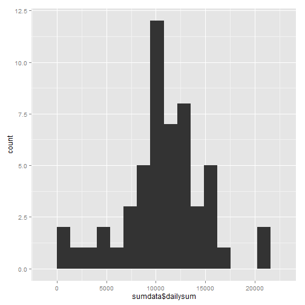
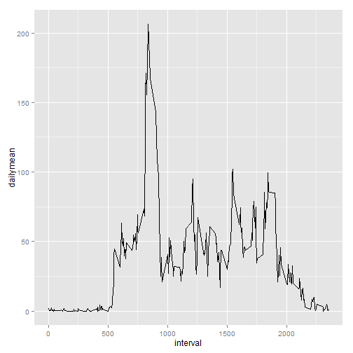
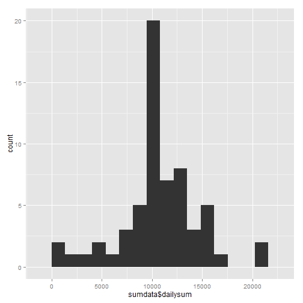

#### Set defaults
Set knitr to echo code by default

```r
#~~~~~~~~~~~~~~~~~~~~~~~~~~~~~~~~~~~~~~~~~~~~~~~~~~~~~~~~~~~~~~~~~~~~~~~~~~~~~~~
# Set echo=TRUE by default
#~~~~~~~~~~~~~~~~~~~~~~~~~~~~~~~~~~~~~~~~~~~~~~~~~~~~~~~~~~~~~~~~~~~~~~~~~~~~~~~
library(knitr)
opts_chunk$set(echo = TRUE)
```

#### Import the R libraries required for the analysis

```r
#~~~~~~~~~~~~~~~~~~~~~~~~~~~~~~~~~~~~~~~~~~~~~~~~~~~~~~~~~~~~~~~~~~~~~~~~~~~~~~~
# Import required libraries
#~~~~~~~~~~~~~~~~~~~~~~~~~~~~~~~~~~~~~~~~~~~~~~~~~~~~~~~~~~~~~~~~~~~~~~~~~~~~~~~
suppressMessages(library(ggplot2))     # General plotting functions
suppressMessages(library(plyr))        # Data manipulation
suppressMessages(library(dplyr))       # Data manipulation
suppressMessages(library(lubridate))   # Handling date values
suppressMessages(library(timeDate))    # Handling date values

#~~~~~~~~~~~~~~~~~~~~~~~~~~~~~~~~~~~~~~~~~~~~~~~~~~~~~~~~~~~~~~~~~~~~~~~~~~~~~~~
# Set paths for files and directory structure
#~~~~~~~~~~~~~~~~~~~~~~~~~~~~~~~~~~~~~~~~~~~~~~~~~~~~~~~~~~~~~~~~~~~~~~~~~~~~~~~
path_data <- './data/activity.csv'
```

#### Loading and preprocessing the data
Read the dataset into R and summarize the data.

```r
#~~~~~~~~~~~~~~~~~~~~~~~~~~~~~~~~~~~~~~~~~~~~~~~~~~~~~~~~~~~~~~~~~~~~~~~~~~~~~~~
# Read the data into R
#~~~~~~~~~~~~~~~~~~~~~~~~~~~~~~~~~~~~~~~~~~~~~~~~~~~~~~~~~~~~~~~~~~~~~~~~~~~~~~~
data <- read.csv(path_data)

#~~~~~~~~~~~~~~~~~~~~~~~~~~~~~~~~~~~~~~~~~~~~~~~~~~~~~~~~~~~~~~~~~~~~~~~~~~~~~~~
# Briefly summarize the dataset
#~~~~~~~~~~~~~~~~~~~~~~~~~~~~~~~~~~~~~~~~~~~~~~~~~~~~~~~~~~~~~~~~~~~~~~~~~~~~~~~
summary(data)
```

```
##      steps               date          interval   
##  Min.   :  0.0   2012-10-01:  288   Min.   :   0  
##  1st Qu.:  0.0   2012-10-02:  288   1st Qu.: 589  
##  Median :  0.0   2012-10-03:  288   Median :1178  
##  Mean   : 37.4   2012-10-04:  288   Mean   :1178  
##  3rd Qu.: 12.0   2012-10-05:  288   3rd Qu.:1766  
##  Max.   :806.0   2012-10-06:  288   Max.   :2355  
##  NA's   :2304    (Other)   :15840
```

```r
str(data)
```

```
## 'data.frame':	17568 obs. of  3 variables:
##  $ steps   : int  NA NA NA NA NA NA NA NA NA NA ...
##  $ date    : Factor w/ 61 levels "2012-10-01","2012-10-02",..: 1 1 1 1 1 1 1 1 1 1 ...
##  $ interval: int  0 5 10 15 20 25 30 35 40 45 ...
```

```r
str(data$steps)
```

```
##  int [1:17568] NA NA NA NA NA NA NA NA NA NA ...
```

```r
str(data$date)
```

```
##  Factor w/ 61 levels "2012-10-01","2012-10-02",..: 1 1 1 1 1 1 1 1 1 1 ...
```

```r
str(data$interval)
```

```
##  int [1:17568] 0 5 10 15 20 25 30 35 40 45 ...
```

#### Transform the Data
The data['date'] field is stored as a factor and needs to be converted to a date.
In addition, the data['steps'] field should be copied over and NA values should be
replaced with real values for use later in the exercise.

```r
#~~~~~~~~~~~~~~~~~~~~~~~~~~~~~~~~~~~~~~~~~~~~~~~~~~~~~~~~~~~~~~~~~~~~~~~~~~~~~~~
# Create a new feature that stores the data$date field as an actual data value.
#~~~~~~~~~~~~~~~~~~~~~~~~~~~~~~~~~~~~~~~~~~~~~~~~~~~~~~~~~~~~~~~~~~~~~~~~~~~~~~~
data$date.trans <- ymd(data$date)
str(data$date.trans)
```

```
##  POSIXct[1:17568], format: "2012-10-01" "2012-10-01" "2012-10-01" "2012-10-01" ...
```

```r
str(data)
```

```
## 'data.frame':	17568 obs. of  4 variables:
##  $ steps     : int  NA NA NA NA NA NA NA NA NA NA ...
##  $ date      : Factor w/ 61 levels "2012-10-01","2012-10-02",..: 1 1 1 1 1 1 1 1 1 1 ...
##  $ interval  : int  0 5 10 15 20 25 30 35 40 45 ...
##  $ date.trans: POSIXct, format: "2012-10-01" "2012-10-01" ...
```

```r
#~~~~~~~~~~~~~~~~~~~~~~~~~~~~~~~~~~~~~~~~~~~~~~~~~~~~~~~~~~~~~~~~~~~~~~~~~~~~~~~
# Impute the missing values in data$steps
#~~~~~~~~~~~~~~~~~~~~~~~~~~~~~~~~~~~~~~~~~~~~~~~~~~~~~~~~~~~~~~~~~~~~~~~~~~~~~~~
data$steps.trans <- mean(data$steps, na.rm = TRUE)
```

#### What is mean total number of steps taken per day?
First, we plot a histogram illustrating the distribution of steps taken per
day.  To do, this we first summarize the data to determine the total number
of steps taken each day.  (Because the raw dataset reports the data in five
minute intervals.)

```r
#~~~~~~~~~~~~~~~~~~~~~~~~~~~~~~~~~~~~~~~~~~~~~~~~~~~~~~~~~~~~~~~~~~~~~~~~~~~~~~~
# Summarize data to determine the total number of steps taken each day.
#~~~~~~~~~~~~~~~~~~~~~~~~~~~~~~~~~~~~~~~~~~~~~~~~~~~~~~~~~~~~~~~~~~~~~~~~~~~~~~~
sumdata <- ddply(data, c('date.trans'), summarise,
               dailysum = sum(steps))

#~~~~~~~~~~~~~~~~~~~~~~~~~~~~~~~~~~~~~~~~~~~~~~~~~~~~~~~~~~~~~~~~~~~~~~~~~~~~~~~
# Create a histogram plot
#~~~~~~~~~~~~~~~~~~~~~~~~~~~~~~~~~~~~~~~~~~~~~~~~~~~~~~~~~~~~~~~~~~~~~~~~~~~~~~~
qplot(sumdata$dailysum, binwidth = 1350)
```

 


Next, we calculate the mean and median total steps per day, ignoring NA values.

```r
#~~~~~~~~~~~~~~~~~~~~~~~~~~~~~~~~~~~~~~~~~~~~~~~~~~~~~~~~~~~~~~~~~~~~~~~~~~~~~~~
# Use data summarized above to determine daily mean and median steps
#~~~~~~~~~~~~~~~~~~~~~~~~~~~~~~~~~~~~~~~~~~~~~~~~~~~~~~~~~~~~~~~~~~~~~~~~~~~~~~~
meansteps <- mean(sumdata$dailysum, na.rm = TRUE)
mediansteps <- median(sumdata$dailysum, na.rm = TRUE)
```

The mean number of steps taken per day is 1.0766 &times; 10<sup>4</sup> and the median number
of steps taken per day is 10765.

#### What is the average daily activity pattern?
Next, we will create a time series plot of the average number of steps across
all days (y-axis) by five-minute interval (x-axis).  To create this plot, we
first use plyr to calculate the average number of steps for each interval prior
to creating the time series plot.

```r
#~~~~~~~~~~~~~~~~~~~~~~~~~~~~~~~~~~~~~~~~~~~~~~~~~~~~~~~~~~~~~~~~~~~~~~~~~~~~~~~
# Summarize data to determine the total number of steps taken each day.
#~~~~~~~~~~~~~~~~~~~~~~~~~~~~~~~~~~~~~~~~~~~~~~~~~~~~~~~~~~~~~~~~~~~~~~~~~~~~~~~
dailyavg <- ddply(data, c('interval'), summarise,
               dailymean = mean(steps, na.rm = TRUE))

#~~~~~~~~~~~~~~~~~~~~~~~~~~~~~~~~~~~~~~~~~~~~~~~~~~~~~~~~~~~~~~~~~~~~~~~~~~~~~~~
# Create the plot
#~~~~~~~~~~~~~~~~~~~~~~~~~~~~~~~~~~~~~~~~~~~~~~~~~~~~~~~~~~~~~~~~~~~~~~~~~~~~~~~
ggplot(dailyavg, aes(x=interval, y=dailymean)) + 
        geom_line()
```

 

Now that we have averaged the number of steps by interval, it is simple to
determine the specific interval that has, on average, the highest number of
steps.

```r
#~~~~~~~~~~~~~~~~~~~~~~~~~~~~~~~~~~~~~~~~~~~~~~~~~~~~~~~~~~~~~~~~~~~~~~~~~~~~~~~
# Use which.max() to determine the row with the maximum number of steps
#~~~~~~~~~~~~~~~~~~~~~~~~~~~~~~~~~~~~~~~~~~~~~~~~~~~~~~~~~~~~~~~~~~~~~~~~~~~~~~~
dailyavg[which.max(dailyavg[,2]),]
```

```
##     interval dailymean
## 104      835     206.2
```

As can be seen above, the interval with the maximum average number of steps
is interval number 835.

####Imputing missing values
First, we determine the number of missing values in the steps field as follows:

```r
#~~~~~~~~~~~~~~~~~~~~~~~~~~~~~~~~~~~~~~~~~~~~~~~~~~~~~~~~~~~~~~~~~~~~~~~~~~~~~~~
# Summarize the data$steps field to see the number of NA values
#~~~~~~~~~~~~~~~~~~~~~~~~~~~~~~~~~~~~~~~~~~~~~~~~~~~~~~~~~~~~~~~~~~~~~~~~~~~~~~~
summary(data$steps)
```

```
##    Min. 1st Qu.  Median    Mean 3rd Qu.    Max.    NA's 
##     0.0     0.0     0.0    37.4    12.0   806.0    2304
```
As can be seen above, the steps field contains 2304 NA
values.  Next, we will create a new dataset that is a copy of the old dataset,
but with NA values replaced by the average for the respective intervals.

```r
#~~~~~~~~~~~~~~~~~~~~~~~~~~~~~~~~~~~~~~~~~~~~~~~~~~~~~~~~~~~~~~~~~~~~~~~~~~~~~~~
# Group by interval number, and calculate the interval means
#~~~~~~~~~~~~~~~~~~~~~~~~~~~~~~~~~~~~~~~~~~~~~~~~~~~~~~~~~~~~~~~~~~~~~~~~~~~~~~~
interval_means <- summarise(grouped <- group_by(data, interval),
                            intmean = mean(steps, na.rm = TRUE))

#~~~~~~~~~~~~~~~~~~~~~~~~~~~~~~~~~~~~~~~~~~~~~~~~~~~~~~~~~~~~~~~~~~~~~~~~~~~~~~~
# Copy the original dataframe, then merge the new interval means dataframe
# with the copy
#~~~~~~~~~~~~~~~~~~~~~~~~~~~~~~~~~~~~~~~~~~~~~~~~~~~~~~~~~~~~~~~~~~~~~~~~~~~~~~~
newdata <- data
merged <- merge(newdata, interval_means, "interval")

#~~~~~~~~~~~~~~~~~~~~~~~~~~~~~~~~~~~~~~~~~~~~~~~~~~~~~~~~~~~~~~~~~~~~~~~~~~~~~~~
# Add a new column containing the steps value, with NA's replaced by the
# interval mean
#~~~~~~~~~~~~~~~~~~~~~~~~~~~~~~~~~~~~~~~~~~~~~~~~~~~~~~~~~~~~~~~~~~~~~~~~~~~~~~~
merged <- mutate(merged, newsteps = ifelse(is.na(steps), intmean, steps))
```
Following these operations, the new column - newsteps - contains no NA values.
0, 0, 0, 37.4, 27, 806

Next, using the new data, we plot a histogram illustrating the distribution of
steps taken per day.  To do, this we first summarize the data to determine the
total number of steps taken each day.  (Because the raw dataset reports the
data in fiveminute intervals.)

```r
#~~~~~~~~~~~~~~~~~~~~~~~~~~~~~~~~~~~~~~~~~~~~~~~~~~~~~~~~~~~~~~~~~~~~~~~~~~~~~~~
# Summarize data to determine the total number of steps taken each day.
#~~~~~~~~~~~~~~~~~~~~~~~~~~~~~~~~~~~~~~~~~~~~~~~~~~~~~~~~~~~~~~~~~~~~~~~~~~~~~~~
sumdata <- ddply(merged, c('date.trans'), summarise,
               dailysum = sum(newsteps))

#~~~~~~~~~~~~~~~~~~~~~~~~~~~~~~~~~~~~~~~~~~~~~~~~~~~~~~~~~~~~~~~~~~~~~~~~~~~~~~~
# Create a histogram plot
#~~~~~~~~~~~~~~~~~~~~~~~~~~~~~~~~~~~~~~~~~~~~~~~~~~~~~~~~~~~~~~~~~~~~~~~~~~~~~~~
qplot(sumdata$dailysum, binwidth = 1350)
```

 


Next, we calculate the mean and median total steps per day.

```r
#~~~~~~~~~~~~~~~~~~~~~~~~~~~~~~~~~~~~~~~~~~~~~~~~~~~~~~~~~~~~~~~~~~~~~~~~~~~~~~~
# Use data summarized above to determine daily mean and median steps
#~~~~~~~~~~~~~~~~~~~~~~~~~~~~~~~~~~~~~~~~~~~~~~~~~~~~~~~~~~~~~~~~~~~~~~~~~~~~~~~
meansteps <- mean(sumdata$dailysum, na.rm = TRUE)
mediansteps <- median(sumdata$dailysum, na.rm = TRUE)
```

The mean number of steps taken per day is 1.0766 &times; 10<sup>4</sup> and the median number
of steps taken per day is 1.0766 &times; 10<sup>4</sup>.

As can be seen above, these numbers differ very little from the mean and median
values determined without imputing missing data.  In this case, imputation of
missing data appears to have made very little difference in the estimates for
the total dfaily number of steps.

#### Are there differences in activity patterns between weekdays and weekends?
To answer this question, we must first add a column to our new dataframe to
indicate weather the falls on a weekday or a weekend.  Then we will make
seperate time series plots of the average steps, by interval, for both weekdays
and weekends.

```r
#~~~~~~~~~~~~~~~~~~~~~~~~~~~~~~~~~~~~~~~~~~~~~~~~~~~~~~~~~~~~~~~~~~~~~~~~~~~~~~~
# Add the factor column indicating whether the date falls on a weekend or
# a weekday.
#~~~~~~~~~~~~~~~~~~~~~~~~~~~~~~~~~~~~~~~~~~~~~~~~~~~~~~~~~~~~~~~~~~~~~~~~~~~~~~~
merged$weekday <- as.factor(ifelse(isWeekday(merged$date.trans),
                                   'weekday', 'weekend'))

#~~~~~~~~~~~~~~~~~~~~~~~~~~~~~~~~~~~~~~~~~~~~~~~~~~~~~~~~~~~~~~~~~~~~~~~~~~~~~~~
# Summarize data to determine the total number of steps taken each day.
#~~~~~~~~~~~~~~~~~~~~~~~~~~~~~~~~~~~~~~~~~~~~~~~~~~~~~~~~~~~~~~~~~~~~~~~~~~~~~~~
dailyavg <- ddply(merged, c('interval', 'weekday'), summarise,
                  dailymean = mean(steps, na.rm = TRUE))

#~~~~~~~~~~~~~~~~~~~~~~~~~~~~~~~~~~~~~~~~~~~~~~~~~~~~~~~~~~~~~~~~~~~~~~~~~~~~~~~
# Create the plot
#~~~~~~~~~~~~~~~~~~~~~~~~~~~~~~~~~~~~~~~~~~~~~~~~~~~~~~~~~~~~~~~~~~~~~~~~~~~~~~~
ggplot(dailyavg, aes(x=interval, y=dailymean)) + 
        geom_line() +
        facet_grid(weekday ~ .)
```

 

Based on the plot above, it appears that there ARE differences in daily activity
patterns between weekends and weekdays.  Most obviously, it is apparent that
activity begins earlier in the day on weekdays, and it continues later into the
evening on weekends.  This makes intuitive sense, in that one would expect that
people to be up earlier on weekdays to go to work, and out later at night on
weekends since they are able to sleep in the following day.

#### Miscellaneous Support Information
Print out system and session information to support future readers in
replicating the environment used to produce the output, and in troubleshooting
any potential issues that arise when running the code.

```r
## ~~~~~~~~~~~~~~~~~~~~~~~~~~~~~~~~~~~~~~~~~~~~~~~~~~~~~~~~~~~~~~~~~~~~~~~~~~~~~
## Print System and Session for reproducibility & troubleshooting.
## ~~~~~~~~~~~~~~~~~~~~~~~~~~~~~~~~~~~~~~~~~~~~~~~~~~~~~~~~~~~~~~~~~~~~~~~~~~~~~
print(sessionInfo())
```

```
## R version 3.1.1 (2014-07-10)
## Platform: x86_64-w64-mingw32/x64 (64-bit)
## 
## locale:
## [1] LC_COLLATE=English_United States.1252 
## [2] LC_CTYPE=English_United States.1252   
## [3] LC_MONETARY=English_United States.1252
## [4] LC_NUMERIC=C                          
## [5] LC_TIME=English_United States.1252    
## 
## attached base packages:
## [1] stats     graphics  grDevices utils     datasets  methods   base     
## 
## other attached packages:
## [1] timeDate_3010.98 dplyr_0.2        Amelia_1.7.3     Rcpp_0.11.3     
## [5] lubridate_1.3.3  plyr_1.8.1       ggplot2_1.0.0    knitr_1.6       
## 
## loaded via a namespace (and not attached):
##  [1] assertthat_0.1   colorspace_1.2-4 digest_0.6.4     evaluate_0.5.5  
##  [5] foreign_0.8-61   formatR_1.0      grid_3.1.1       gtable_0.1.2    
##  [9] htmltools_0.2.6  labeling_0.3     markdown_0.7.4   MASS_7.3-35     
## [13] memoise_0.2.1    mime_0.2         munsell_0.4.2    parallel_3.1.1  
## [17] proto_0.3-10     reshape2_1.4     rmarkdown_0.3.3  scales_0.2.4    
## [21] stringr_0.6.2    tools_3.1.1      yaml_2.1.13
```

```r
# print(Sys.info())   omit Sys.info() for privacy reasons
```
